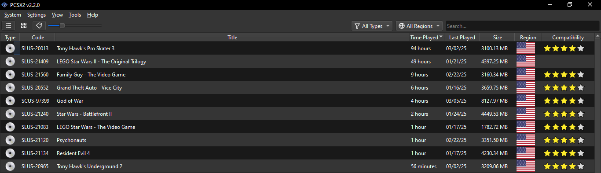
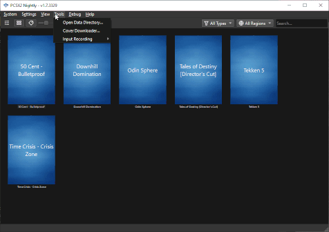
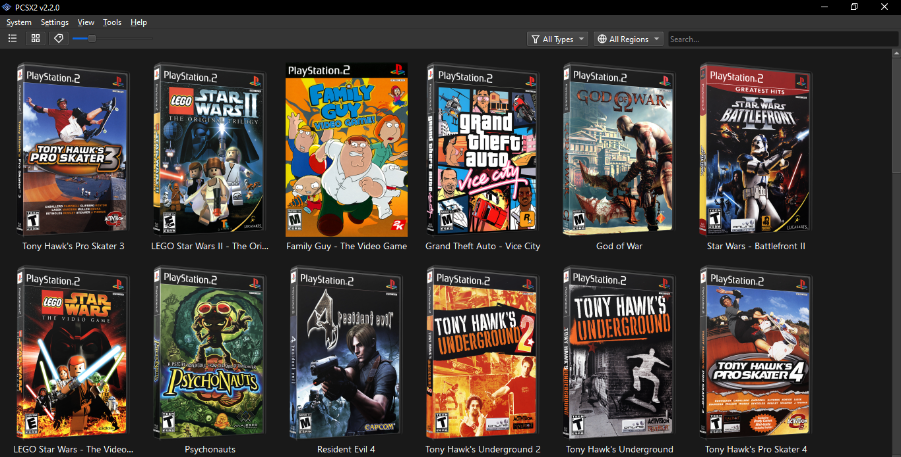

# The Quest for Maximal Nostalgia
### by Nico Paganelli 3/14/25

I use [PCSX2](https://pcsx2.net/) to [emulate](https://en.wikipedia.org/wiki/Video_game_console_emulator) the Playstation 2 console on my computer. It allows users to burn their PS2 games onto their computer and play them all in a convenient and portable manner.

I don't know if it's gamers as a whole or my age demographic that's growing up, but there seems to be a growing sentiment that the last few generations of consoles just don't seem to resonate like this beauty:

But when it's time to get my nostalgia gaming on, there's a bunch of reasons why it's just easier to break out an emulator and connect a PS4 controller to my computer. The problem is that the first time I loaded my game library into PCSX2, the game list looked like this:

 
 

Yes, I'm emulating the PS2 on a modern computer, but I want to maximize my nostalgia. That means deliberately adding the PS2 boot up screen when loading games, using standard format screen resolution, and it certainly means not scrolling through an ugly list of text to pick my games! In short, I wanted my emulator to follow the principle of **"Match[ing] between system and the real world"**, one of the 10 [design principles](https://www.nngroup.com/articles/ten-usability-heuristics/) that makes applications user friendly and **learnable**. I want my game library on my computer to look like the one sitting on my shelf.

After doing some digging online, I found a github page that showed me how to quickly make my entire library look just like my physical one at home. [link to tutorial](https://github.com/xlenore/ps2-covers)

It also has a really convenient README (instruction file) that had my library looking snazzy in under 5 minutes. Here is a gif of the instructions which was provided in the README:
  

   
And by following those instructions, my library now matches my **mental model** of what a game library should look like. Most of the covers are even 3D so it really feels like I'm flipping through cases in a dusty old cabinet under the TV!:

  

Overall, I found the design of the app to not fall inline with the **recognition rather than recall** principle, which is another design principle from the list I linked earlier. Basically, there is an insane amount of configuration that can be done with the app and none of it is clear or intuitive to get to.  
Trying to find covers was a perfect example. I didn't even know it was an option until I got bored and started looking through every setting available for a game. Then I didn't know there was a way to load covers for all games at once until I googled something related and found a 3rd party github link.  
I think that given this application is made for relatively tech savvy people, it's not a dealbreaker for me that the menus are a bit cryptic, but the least they can do is seriously buff up the **help and documentation** which is [sparse](https://pcsx2.net/docs/) to say the least.
